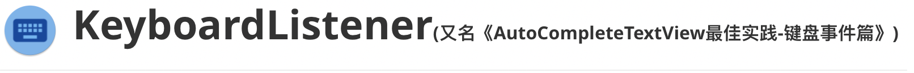
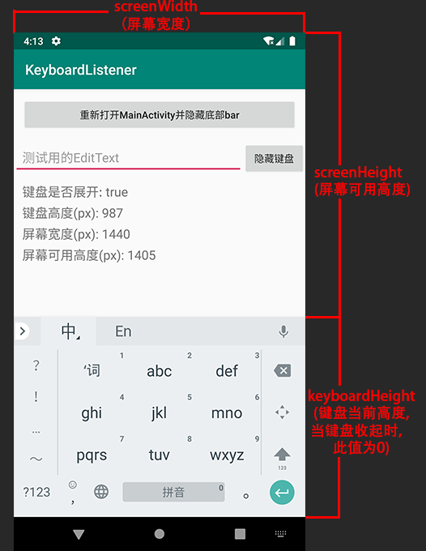

# 

**关于作者**

> 景三，程序员，主要从事Android平台基础架构方面的工作，欢迎交流技术方面的问题，可以去我的[Github](https://github.com/relish-wang)提issue或者发邮件至relish.wang@gmail.com与我交流。

[TOC]

## 零、项目简介

从[facebook/react-native](https://github.com/facebook/react-native)源码中抽离出来的用于**监听Android软键盘弹出与收回事件**的相关代码。

**扫描二维码下载Demo**


<center><strong>KeyboardListener-Demo.apk</strong></center>

## 一、效果演示


<center><strong>图1 显示底部NavigationBar的情况</strong><br>(注意“屏幕可用高度”的数值)</center>


<center><strong>图2 隐藏底部NavigationBar的情况</strong><br>(注意“屏幕可用高度”的数值)</center>

## 二、使用方法

可以直接把[DisplayMetricsHolder](./app/src/main/java/wang/relish/keyboard/util/DisplayMetricsHolder.java)、[GlobalLayoutListener](./app/src/main/java/wang/relish/keyboard/util/GlobalLayoutListener.java)、[OnKeyboardChangedListener]((./app/src/main/java/wang/relish/keyboard/util/OnKeyboardChangedListener.java))三个文件直接拷贝到你的工程里使用。

```
rootView.getViewTreeObserver().addOnGlobalLayoutListener(
        new GlobalLayoutListener(rootView, new OnKeyboardChangedListener() {
            /**
             * 键盘事件
             *
             * @param isShow         键盘是否展示
             * @param keyboardHeight 键盘高度(当isShow为false时,keyboardHeight=0)
             * @param screenWidth    屏幕宽度
             * @param screenHeight   屏幕可用高度(不包含底部虚拟键盘NavigationBar), 即屏幕高度-键盘高度(keyboardHeight)
             */
            @Override
            public void onChange(boolean isShow, int keyboardHeight, int screenWidth, int screenHeight) {
                // do sth.
            }
        }));
```



## 三、更新日志

[CHANGELOG.md](./CHANGELOG.md)

## 四、致谢

感谢[facebook/react-native](https://github.com/facebook/react-native)提供代码解决方案。

本仓库使用的react-native相关代码:

- [ReactRootView.java](https://github.com/facebook/react-native/blob/135ba492fbd500ec555baadab7ff1db3d537acf3/ReactAndroid/src/main/java/com/facebook/react/ReactRootView.java)里的内部类CustomGlobalLayoutListener

  监听键盘事件的监听器。

- [DisplayMetricsHolder.java](https://github.com/facebook/react-native/blob/4d95e85f64a496d9b9539b6218d1737997a315da/ReactAndroid/src/main/java/com/facebook/react/uimanager/DisplayMetricsHolder.java)

  通过反射获取相关尺寸数值。

- [PixelUtil.java](https://github.com/facebook/react-native/blob/4936d284df36071047ce776d9e2486c0371f7b97/ReactAndroid/src/main/java/com/facebook/react/uimanager/PixelUtil.java)(非必要)

  度量单位转换工具。px<->sp/dp之间的转化。
